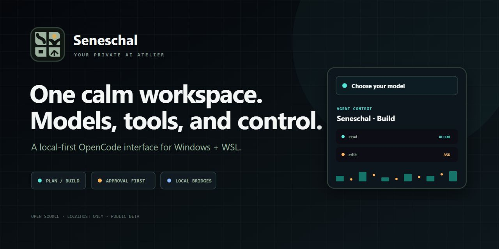
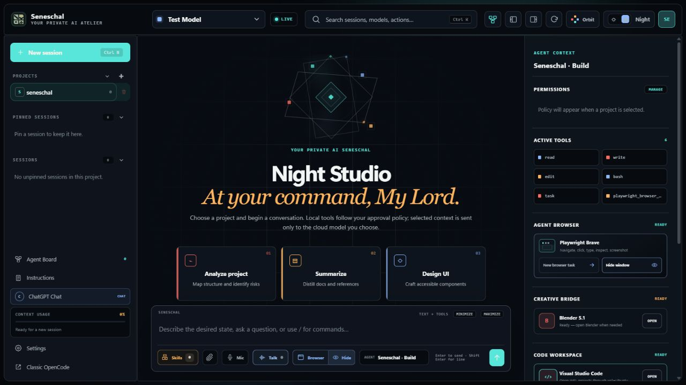
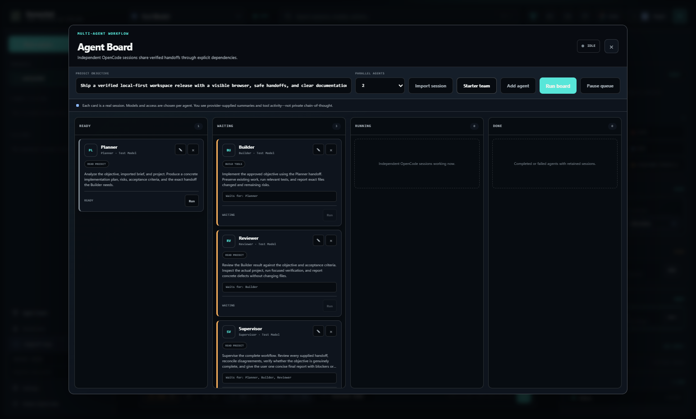

# Seneschal

**Your private AI atelier.**



Seneschal gives OpenCode a focused, personal interface on Windows and WSL: per-session model switching, Plan/Build/Chat roles, approval controls, instruction and skill editing, session navigation, pinned and archived messages, attachments, voice input, a multi-agent workflow board, visible browser automation, VS Code launching, optional Blender status, and a matte day/night visual system.

This is a public beta. It is useful today, but it is not a replacement for understanding which model provider you are using or what an approved tool action can change.

## What it is

- A custom browser interface served only on `127.0.0.1`
- A secure local proxy in front of OpenCode's server
- A Windows launcher for an OpenCode installation inside WSL
- A visual editor for persona, general instructions, project instructions, roles, and reusable skills
- A permission-oriented workspace where Plan is read-only and Build asks before changes by default
- A persistent Agent Board that can turn an existing planning session into a shared brief, then coordinate model-specific workers through explicit dependencies and a configurable supervisor
- A local VS Code bridge plus an optional companion button for opening the current WSL project, choosing one of its Seneschal sessions, or creating a new one

It is not an AI model, a provider subscription, or a way around provider usage limits.

## Interface



The image above is a privacy-safe product illustration based on the real interface. It shows the three-part workspace, approval controls, activity reporting, and local bridge status without exposing a user's sessions or provider account.

### Agent Board



Every board card is a real OpenCode session with its own model, role, access profile, status, and retained transcript. Import the current planning session to use its conversation as the project's source brief, then add the Starter team or build a custom team. Agents can run in parallel up to the chosen concurrency limit. A downstream agent starts only after all selected dependencies complete and receives their output as a labelled handoff.

Each card can be stopped, edited, retried, or opened as a normal retained session. The Supervisor is not a special hidden process: it is a configurable board agent, can use any connected model, and should depend on every worker it must check. Seneschal shows provider-supplied reasoning summaries, tool activity, and final handoffs; private chain-of-thought is not exposed.

## Requirements

- Windows 11
- WSL with an installed Linux distribution (Ubuntu is the default)
- Node.js 20 or newer on Windows
- OpenCode installed and working inside that WSL distribution
- At least one model provider connected through OpenCode

Brave is preferred when installed. Otherwise, Seneschal opens in the Windows default browser. When the Playwright integration is installed, its Browser control can switch the separate agent-controlled Brave window between hidden and visible mode. Explicit browser requests automatically enable visible mode before the task starts, and beta 12 repairs older launchers that ignored this setting. VS Code is detected locally and opens WSL folders through the installed Remote WSL support. Blender and browser automation remain optional and require their own local integrations.

## Install

1. Download the latest beta ZIP from [Releases](https://github.com/Rammeshgar/seneschal/releases).
2. Extract it to a normal folder.
3. Double-click `install.cmd`.
4. Open **Seneschal** from the desktop shortcut.

The installer copies the app to `%LOCALAPPDATA%\Seneschal`, detects the WSL home folder, creates a local desktop shortcut, and preserves any existing OpenCode configuration. If your distribution is not named Ubuntu, run:

```powershell
powershell -ExecutionPolicy Bypass -File .\install.ps1 -WslDistribution "YourDistroName"
```

## Providers and cost

Provider accounts and API keys stay in OpenCode; this interface does not put credentials in its frontend. ChatGPT subscriptions and provider APIs are separate products. A model labelled free can still be temporary, rate-limited, or unavailable upstream.

The `$10` display is a soft local target. Set a real hard limit with the provider whenever the provider supports one.

## Security and privacy

- The workspace binds to localhost, not the local network.
- A random local session secret and a separate OpenCode server password are generated at first launch.
- Runtime secrets, sessions, backups, and settings live in `data/`, which is excluded from Git.
- Share links are disabled in the starter OpenCode configuration.
- Existing OpenCode configuration files are not overwritten by the installer.
- Any cloud model you select still receives the prompt and context required for the request.

Read [SECURITY.md](SECURITY.md) before exposing or modifying the local server.

## Integrations

- **Agent Board:** built in; import the current planning session, choose each worker's model/access/dependencies, run or stop cards independently, and keep every linked session.
- **Visual Studio Code:** built in when `Code.exe` is detected; open the project from the header/inspector or install the optional companion for a Seneschal status-bar button inside VS Code.
- **Playwright Brave:** optional MCP integration; tasks can run hidden or in a visible agent-controlled window.
- **Blender:** optional MCP integration with local bridge status and launch control.

The public beta does not silently install browser extensions, MCP servers, Blender add-ons, VS Code extensions, or paid services.

## Settings

Machine-specific values are stored locally in `%LOCALAPPDATA%\Seneschal\data\settings.json`:

```json
{
  "wslDistribution": "Ubuntu",
  "wslLinuxHome": "/home/yourname",
  "launchDirectory": "/home/yourname/projects",
  "blenderExecutable": "C:\\Program Files\\Blender Foundation\\Blender 5.1\\blender.exe"
}
```

The Blender entry is optional; common installed versions are detected automatically.

## Known limits

- Windows/WSL only in this beta
- Tested against OpenCode 1.18.x; upstream API changes can break parts of the interface
- Provider model lists and capabilities are controlled by OpenCode and the provider
- Full private model reasoning is not exposed; the UI can show provider-supplied summaries and live tool activity
- Browser and Blender bridges must be installed separately; Seneschal can repair its older hidden-only Playwright launcher but cannot create a missing Playwright installation
- Agent Board handoffs use completed textual outputs; files remain shared through the selected project folder
- The VS Code companion links a project to Seneschal sessions; it is not an inline completion engine or a replacement for Copilot-style editor intelligence
- The local cost figure is informational, not a guaranteed cap

## Development

```powershell
npm test
npm start
```

The server intentionally has no npm runtime dependencies.

## License

Seneschal is MIT licensed. OpenCode's license is included separately in `docs/OPENCODE-LICENSE.txt`.

## Images and screenshots

- Public product visuals live in `docs/images/`.
- Reusable logos, GitHub previews, LinkedIn artwork, and source files live in `assets/`.
- Put images that must appear inside the running interface in `app/assets/`; reference them as `/workspace/assets/filename.webp`.

Prefer WebP or AVIF for large interface backgrounds, PNG for screenshots, and SVG for logos. Do not place personal screenshots, API keys, browser profiles, or private session content in the public repository.
